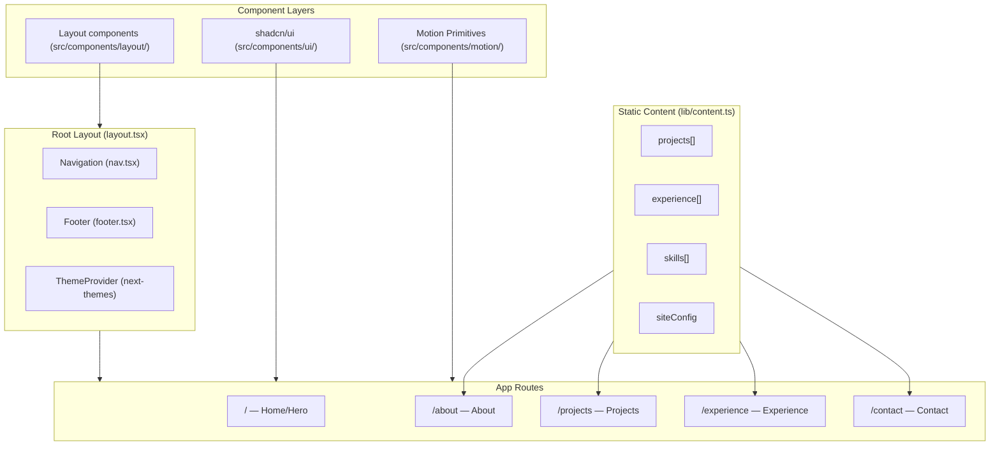

# feat: Build Morris Yang Personal Portfolio Website

## Summary

Greenfield personal portfolio for Morris Yang built with Next.js 15 App Router, Tailwind v4, shadcn/ui (new-york style), and the `motion` library. Five separate pages with multi-page routing: Home, About, Projects, Experience, and Contact. Dark-mode-first, content driven by static TypeScript config files, deployed to Vercel from `morris-y/Morris`.

---

## Problem Frame

Morris Yang needs a personal website as a portfolio anchor for commercial collaborations and personal branding around his work in AI × prediction markets × on-chain data. The GitHub repo `morris-y/Morris` exists and is git-initialized but contains only a README. No site has been built yet.

---

## Requirements

**Foundations**
- R1. Project initializes with Next.js 15 App Router, TypeScript strict mode, Tailwind v4, shadcn/ui (new-york), and the `motion` library.
- R2. Dark-mode-first design using CSS custom properties; class-based dark mode toggle via `next-themes`.
- R3. Mobile-first responsive layout; all pages are usable at 375px viewport width.
- R4. Deployable to Vercel from the `morris-y/Morris` GitHub repo with zero additional configuration.

**Content**
- R5. All structured content (projects, experience, skills, site config) is stored in static TypeScript config files; no CMS, database, or data fetching.
- R6. Projects page displays at minimum: Prediction Markets Trading Terminal (with outcomes: $200k–$300k/mo volume, Top 50 Polymarket Builders) and Hubble AI Platform (outcomes: Solana-first, sub-1s latency target).
- R7. Experience section covers Hubble AI (Senior PM and PM/QA roles), Binance (PM Contract), Gate.io (Researcher), and NAX Lab (PM).

**Pages and Navigation**
- R8. Five distinct Next.js routes: `/` (Home/Hero), `/about`, `/projects`, `/experience`, `/contact`.
- R9. Persistent navigation header links to all five pages; the active page is visually indicated.
- R10. The `motion` library powers scroll-triggered section animations, page entry animations, and card hover effects.

**Non-functional**
- R11. No blog, MDX, or CMS in this phase.
- R12. No Three.js or 3D elements.

---

## Key Technical Decisions

- **`motion` package (not `framer-motion`)**: Framer Motion was rebranded to `motion` in 2024; current version is 12.40.0. Import from `motion/react-client` in App Router pages to prevent server-side import errors.
- **`tw-animate-css` replaces `tailwindcss-animate`**: shadcn/ui's animation plugin for Tailwind v4 is `tw-animate-css`; `tailwindcss-animate` is deprecated and does not work with v4.
- **Dark mode via `@custom-variant dark` + `@theme inline`**: Tailwind v4's `@theme inline` bakes utility values at build time; without `@custom-variant dark (&:is(.dark *))`, runtime CSS variable swaps do not propagate to Tailwind utilities.
- **Motion Primitives via copy-paste**: The shadcn CLI integration for `motion-primitives` has a known broken registry URL (upstream issue #9370). Components are manually copied from `motion-primitives.com/docs` into `src/components/motion/`.
- **Route group `(site)` for page files**: Keeps the App Router directory organized without adding a URL segment.
- **Geist font via `next/font/google`**: Self-hosted at build time; no Google Fonts runtime request. Uses the `variable` option so Tailwind v4 utilities can reference the CSS custom property.
- **shadcn/ui new-york style**: The `default` style is deprecated in recent shadcn/ui versions; `new-york` is the recommended default for new projects.
- **Static TypeScript config for content**: All site data exported from `src/lib/content.ts`; pages import arrays directly with no async data fetching.

---

## High-Level Technical Design



---

## Output Structure

```
src/
├── app/
│   ├── (site)/
│   │   ├── about/page.tsx
│   │   ├── projects/page.tsx
│   │   ├── experience/page.tsx
│   │   ├── contact/page.tsx
│   │   └── page.tsx              # Home / Hero
│   ├── globals.css
│   ├── layout.tsx
│   └── not-found.tsx
├── components/
│   ├── ui/                       # shadcn/ui components
│   ├── motion/                   # Motion Primitives (copy-paste)
│   ├── layout/
│   │   ├── nav.tsx
│   │   ├── footer.tsx
│   │   └── theme-toggle.tsx
│   ├── hero.tsx
│   ├── about/
│   │   ├── bio-section.tsx
│   │   └── skills-section.tsx
│   ├── projects/
│   │   ├── project-card.tsx
│   │   └── projects-grid.tsx
│   ├── experience/
│   │   ├── timeline.tsx
│   │   └── timeline-item.tsx
│   └── contact/
│       └── social-links.tsx
├── lib/
│   ├── content.ts                # All static site data
│   └── utils.ts                  # cn() helper (auto-generated by shadcn)
└── types/
    └── content.ts                # TypeScript interfaces for content data
```

---

## Implementation Units

### U1. Project scaffolding and dependency setup

**Goal:** Bootstrap the Next.js 15 project inside the existing empty `Morris` repo with the full dependency stack configured and verified.

**Requirements:** R1, R2, R4

**Dependencies:** none

**Files:**
- `package.json`
- `next.config.ts`
- `tsconfig.json`
- `components.json`
- `src/app/globals.css`
- `.gitignore`

**Approach:**
- Run `create-next-app` with `--typescript --tailwind --app --src-dir --import-alias "@/*"` targeting the existing repo directory.
- Run `npx shadcn@latest init`, selecting new-york style, zinc base color, CSS variables enabled.
- Install `motion`, `tw-animate-css`, and `next-themes`.
- In `globals.css`: add `@import "tw-animate-css"`, define all shadcn CSS token variables in `:root` and `.dark`, add `@custom-variant dark (&:is(.dark *))`, and wire `@theme inline` to map CSS variables to Tailwind color utilities.
- Confirm dev server starts without TypeScript or build errors.

**Test scenarios:**
- `npm run dev` starts without TypeScript errors or build failures.
- `globals.css` has `:root` and `.dark` variable blocks and `@custom-variant dark` line.
- `npx shadcn@latest add button` adds `src/components/ui/button.tsx` without errors.
- `npm run build` exits 0.

**Verification:** Dev server and build both succeed; shadcn component add works.

---

### U2. Root layout: fonts, navigation, and theme provider

**Goal:** Establish the persistent shell all pages share — Geist font, navigation header, footer, and dark/light mode toggle.

**Requirements:** R2, R3, R8, R9

**Dependencies:** U1

**Files:**
- `src/app/layout.tsx`
- `src/components/layout/nav.tsx`
- `src/components/layout/footer.tsx`
- `src/components/layout/theme-toggle.tsx`

**Approach:**
- `layout.tsx`: load `Geist` and `Geist_Mono` via `next/font/google` using the `variable` option; apply both CSS variable class names to `<html>`; wrap children in a `ThemeProvider` from `next-themes` with `attribute="class"` and `defaultTheme="dark"`.
- `nav.tsx`: horizontal links for all five routes on desktop; collapsible hamburger (shadcn `Sheet`) on mobile. Active link highlighted via `usePathname()`.
- `footer.tsx`: name, copyright year, and icon links to X, LinkedIn, Medium.
- `theme-toggle.tsx`: button using `useTheme()` from `next-themes` to toggle between dark and light; moon/sun icon from `lucide-react`.

**Test scenarios:**
- Nav renders on every page route.
- Active route link has a visually distinct style from inactive links.
- Theme toggle switches `<html class>` between `dark` and `light`; colors update immediately.
- On a 375px viewport, desktop nav is hidden and hamburger is visible.
- Page title updates per route (set via Next.js `metadata` export).

**Verification:** Navigate all routes; toggle theme; test mobile viewport in browser dev tools.

---

### U3. Static content data layer

**Goal:** Define all site content as typed TypeScript constants so pages import data rather than hardcode strings.

**Requirements:** R5, R6, R7

**Dependencies:** U1

**Files:**
- `src/types/content.ts`
- `src/lib/content.ts`

**Approach:**
- `types/content.ts`: TypeScript interfaces for `Project`, `ExperienceItem`, `SiteConfig`, and `Skill`.
- `lib/content.ts`: export `projects` (array), `experience` (array), `skills` (string array), and `siteConfig` (name, tagline, bio, email, socials with URLs for X, LinkedIn, Medium).
- `projects` includes at minimum: Prediction Markets Trading Terminal (description, tech stack array, outcomes string, optional external link) and Hubble AI Platform (same shape).
- `experience` entries include: company, role, dateRange, description, and a `bullets` string array for impact points; covers Hubble AI × 2 roles, Binance, Gate.io, NAX Lab.

**Test scenarios:**
- `npx tsc --noEmit` passes with zero errors.
- `projects` array has ≥ 2 entries; each entry has non-empty `title`, `description`, `techStack`, and `outcomes`.
- `experience` array has ≥ 4 entries; each has non-empty `company`, `role`, and `dateRange`.
- `siteConfig.name === "Morris Yang"`.

**Verification:** TypeScript compiles cleanly; spot-check values by importing in a page and rendering.

---

### U4. Home page — Hero

**Goal:** Build the `/` landing page with a staggered entry animation introducing Morris Yang.

**Requirements:** R3, R8, R10

**Dependencies:** U2, U3

**Files:**
- `src/app/(site)/page.tsx`
- `src/components/hero.tsx`

**Approach:**
- Content: full name, positioning tagline (`"Product Builder | AI × On-chain Data × Prediction Markets"`), one-line bio drawn from `siteConfig`, two CTA buttons (View Projects → `/projects`, About Me → `/about`).
- Staggered entry animation via `motion/react-client`: each element starts at `{ opacity: 0, y: 20 }`, animates to `{ opacity: 1, y: 0 }` with incremental `delay` (0.1s steps). Name first, tagline second, bio third, CTAs last.
- Layout: full-viewport-height on desktop (`min-h-screen`), vertically centered; readable single-column on mobile.
- No background image or 3D; a subtle gradient or noise texture in CSS only.

**Test scenarios:**
- Page renders at `/` without console errors.
- Name, tagline, and both CTA buttons are visible after animation completes.
- "View Projects" button navigates to `/projects`.
- "About Me" button navigates to `/about`.
- On 375px viewport, content stacks vertically and is readable without horizontal scroll.

**Verification:** Load `/`; watch stagger animation; click both CTAs.

---

### U5. About page

**Goal:** Build `/about` with Morris's background narrative and a skill tag cloud.

**Requirements:** R3, R8

**Dependencies:** U2, U3

**Files:**
- `src/app/(site)/about/page.tsx`
- `src/components/about/bio-section.tsx`
- `src/components/about/skills-section.tsx`

**Approach:**
- `BioSection`: three prose paragraphs covering the arc — Communications background → Web3/blockchain research → AI × trading systems at Hubble AI. Bio prose stored as a `bio` string field in `siteConfig` inside `content.ts` (consistent with R5); `BioSection` renders it from there rather than hardcoding inline.
- `SkillsSection`: shadcn `Badge` components for technology and domain tags drawn from `content.ts` `skills` array.
- Each section uses `motion/react-client` `whileInView` with `once: true` to fade in on scroll entry. Wrap all motion variants with `useReducedMotion()` from `motion/react`; when true, render elements at their final state immediately with no positional animation.
- Page-level metadata: `export const metadata = { title: "About — Morris Yang" }`.

**Test scenarios:**
- Page renders at `/about` without errors.
- Bio text contains at least three paragraphs of narrative content.
- Skill badges render with correct labels from `content.ts`.
- Sections are invisible below fold; animate in when scrolled into viewport.
- Readable at 375px without overflow.

**Verification:** Visit `/about`; scroll to trigger `whileInView` animations; verify badges.

---

### U6. Projects page

**Goal:** Build `/projects` with a responsive card grid, hover lift effect, and outcome metrics for each project.

**Requirements:** R3, R6, R8, R10

**Dependencies:** U2, U3

**Files:**
- `src/app/(site)/projects/page.tsx`
- `src/components/projects/project-card.tsx`
- `src/components/projects/projects-grid.tsx`

**Approach:**
- `ProjectCard`: shadcn `Card` containing title, description, tech stack badges (shadcn `Badge`), and an outcomes chip (e.g., "$200k–$300k/mo trading volume", "Top 50 Polymarket Builders Program"). Optional external link renders as a small icon button with `aria-label="View [project.title] (opens in new tab)"`.
- Hover effect: `whileHover={{ y: -4 }}` lift plus Tailwind `hover:shadow-lg` for depth. Respect `useReducedMotion()`: skip the lift when the user prefers reduced motion.
- `ProjectsGrid`: maps `content.ts` `projects` array to `ProjectCard` components; staggered entrance via `motion/react-client` using `variants` with `staggerChildren`.
- Grid: `grid-cols-1 md:grid-cols-2` — single column mobile, two columns desktop.

**Test scenarios:**
- Page renders at `/projects` without errors.
- Both project cards render with title, description, and ≥1 tech badge.
- Outcome metric text is visible on each card.
- Hovering a card lifts it visually (y translate observed in browser).
- Grid is 2-col on 1280px, 1-col on 375px.
- External link (if present) opens in a new tab.

**Verification:** Visit `/projects`; hover cards; check responsive layout.

---

### U7. Experience page

**Goal:** Build `/experience` with a vertical timeline of work history sourced from the content config.

**Requirements:** R3, R7, R8

**Dependencies:** U2, U3

**Files:**
- `src/app/(site)/experience/page.tsx`
- `src/components/experience/timeline.tsx`
- `src/components/experience/timeline-item.tsx`

**Approach:**
- `Timeline`: a vertical layout with a 1px left border acting as the timeline line (Tailwind `border-l`).
- `TimelineItem`: dot marker on the line, company name, role, date range, and a bullet list of 2–3 impact points from the `bullets` field in `content.ts`.
- Items render in reverse-chronological order (most recent first).
- `whileInView` stagger: each item fades in from the left as it enters the viewport. Apply `useReducedMotion()` check; users with vestibular sensitivity preferences see items at their final state immediately.
- An education section below the work timeline covers NCCU MA Communications and notable scholarships.

**Test scenarios:**
- Page renders at `/experience` without errors.
- All work experience entries appear in reverse-chronological order.
- The page shows entries for Hubble AI (with both Senior PM and PM/QA roles listed separately), Binance, Gate.io, and NAX Lab.
- Each entry shows company, role, and date range.
- Timeline line connector is visible between entries on desktop.
- Education section renders below work history.
- Items animate in on scroll.

**Verification:** Visit `/experience`; scroll through; confirm order and connector line.

---

### U8. Contact page

**Goal:** Build `/contact` with a clear invitation and social link buttons.

**Requirements:** R3, R8

**Dependencies:** U2, U3

**Files:**
- `src/app/(site)/contact/page.tsx`
- `src/components/contact/social-links.tsx`

**Approach:**
- Minimal layout: a heading, one-sentence invitation ("Let's build something interesting together"), then a row/grid of link buttons for each social: X (@MorrisSHYang), LinkedIn, Medium, and email (mailto).
- Use shadcn `Button` with `variant="outline"` and `lucide-react` icons (Twitter/X, Linkedin, FileText, Mail).
- Links sourced from `siteConfig.socials` and `siteConfig.email` in `content.ts`.
- All external links have `target="_blank"` and `rel="noopener noreferrer"`.
- Simple `motion/react-client` fade-in entry on page load.

**Test scenarios:**
- Page renders at `/contact` without errors.
- X, LinkedIn, Medium, and email links are present.
- Each link navigates to the correct external URL (or `mailto:` for email).
- All external links open in a new tab.
- Page is readable on 375px viewport.

**Verification:** Visit `/contact`; click each link; verify destinations and tab behavior.

---

## Scope Boundaries

**In scope:**
- Five Next.js routes with multi-page routing
- Dark-mode-first Tailwind v4 + shadcn/ui design
- `motion` animations: entry, scroll-triggered `whileInView`, card hover
- Static TypeScript content config

**Deferred to Follow-Up Work:**
- Blog / MDX writing section (Phase 2)
- Open Graph image generation via `next/og`
- Vercel Analytics
- Contact form with email delivery (Resend or similar)
- Project detail pages (`/projects/[slug]`)
- Site search

**Outside scope:**
- CMS or database
- Authentication
- Three.js / 3D effects
- Server-side API routes

---

## Risks & Dependencies

- **`motion-primitives` CLI broken**: Components from `motion-primitives.com` must be copy-pasted manually into `src/components/motion/`. This is a manual step per component but is not blocking; the copy-paste model is intentional per the library's design.
- **Tailwind v4 `@theme inline` dark mode**: The `@custom-variant dark` declaration in `globals.css` is required. Omitting it causes dark mode CSS variable swaps to not propagate to Tailwind utilities. Addressed in U1.
- **`next-themes` client boundary**: `ThemeProvider` must be a client component wrapping the root layout; placing it server-side causes a hydration mismatch. Addressed in U2 approach.

---

## Sources / Research

- Stack compatibility research (2026-06-07): `motion` v12.40.0, `tw-animate-css`, shadcn/ui new-york, `@custom-variant dark` pattern, `next-themes` for class-based dark mode.
- Reference template: [github.com/ibelick/nim](https://github.com/ibelick/nim) — Next.js 15 + React 19 + Tailwind v4 + Motion Primitives canonical reference.
- Known issue: motion-primitives shadcn CLI registry URL broken (ibelick/motion-primitives issue #112, shadcn-ui/ui issue #9370); copy-paste workaround documented.
- /last30days research (2026-06-07): Next.js + motion + Tailwind is community consensus for 2026 portfolio stack; Motion Primitives at 5.6K stars growing as the copy-paste animation layer.
